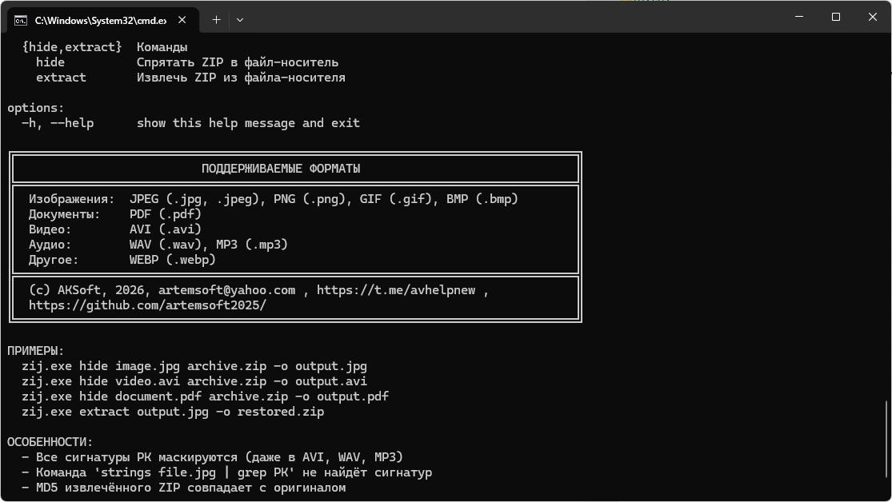

# POLYGLOT TOOL zij 1.0

## НАЗНАЧЕНИЕ:

  Сокрытие ZIP-архива внутри файлов различных форматов (изображения, видео,
  аудио, документы) с полной маскировкой сигнатур PK.




---

## ИСПОЛЬЗОВАНИЕ:
- zij.exe {hide|extract} [аргументы]

КОМАНДЫ:
- hide    - спрятать ZIP-архив внутри файла-носителя
- extract - извлечь ZIP-архив из файла-носителя

---
## КОМАНДА HIDE - Сокрытие архива
---

## СИНТАКСИС:
```cmd
  zij.exe hide <носитель> <архив> [-o <выходной_файл>]

ПАРАМЕТРЫ:
  <носитель>        - файл, внутри которого будет спрятан архив
  <архив>           - ZIP-архив, который нужно спрятать
  -o <выходной>     - имя выходного файла (по умолчанию: output.bin)

ПРИМЕРЫ:
  # Спрятать в PNG
  zij.exe hide image.png secret.zip -o hidden.png

  # Спрятать в JPEG
  zij.exe hide photo.jpg archive.zip -o output.jpg

  # Спрятать в PDF
  zij.exe hide document.pdf data.zip -o hidden.pdf

  # Спрятать в AVI
  zij.exe hide video.avi backup.zip -o hidden.avi

  # Спрятать в MP3
  zij.exe hide song.mp3 files.zip -o hidden.mp3
```
---
## КОМАНДА EXTRACT - Извлечение архива
---

## СИНТАКСИС:
```cmd
  zij.exe extract <файл> [-o <выходной_архив>]

ПАРАМЕТРЫ:
  <файл>            - файл со скрытым архивом
  -o <выходной>     - имя выходного ZIP-архива (по умолчанию: restored.zip)

ПРИМЕРЫ:
  # Извлечь с именем по умолчанию
  zij.exe extract hidden.png

  # Извлечь с указанием имени
  zij.exe extract hidden.png -o my_archive.zip

  # Извлечь из PDF
  zij.exe extract hidden.pdf -o extracted.zip

  # Извлечь из AVI
  zij.exe extract hidden.avi -o backup.zip
```

---
ПОДДЕРЖИВАЕМЫЕ ФОРМАТЫ НОСИТЕЛЕЙ
---
```cmd
  ИЗОБРАЖЕНИЯ:  JPEG (.jpg, .jpeg)
                PNG (.png)
                GIF (.gif)
                BMP (.bmp)

  ДОКУМЕНТЫ:    PDF (.pdf)

  ВИДЕО:        AVI (.avi)

  АУДИО:        WAV (.wav)
                MP3 (.mp3)

  ДРУГИЕ:       WEBP (.webp)
```
---
ОСОБЕННОСТИ
---

  1. ПОЛНАЯ МАСКИРОВКА СИГНАТУР PK
     - Все сигнатуры PK (50 4B 03 04, 50 4B 01 02, 50 4B 05 06) заменяются
       на замаскированные байты
     - Команда "strings file.png | grep PK" НЕ НАЙДЁТ сигнатур
     - Работает для ВСЕХ форматов без исключения

  2. ПОЛНОЕ ВОССТАНОВЛЕНИЕ
     - При извлечении ZIP восстанавливается бит-в-бит
     - MD5 сумма совпадает с оригиналом
     - Все файлы в архиве распаковываются без ошибок

  3. СОХРАНЕНИЕ ФУНКЦИОНАЛЬНОСТИ
     - Файл-носитель после сокрытия остаётся работоспособным
     - Изображения открываются в просмотрщиках
     - Видео проигрывается в плеерах
     - PDF читается в документах

  4. КОНТРОЛЬ ЦЕЛОСТНОСТИ
     - Встроенная проверка MD5
     - При несовпадении MD5 выводится предупреждение

---
ПРИМЕР ПОЛНОГО ЦИКЛА РАБОТЫ
---
```cmd
  # 1. Создаём тестовый архив
  echo "Секретный текст" > secret.txt
  zip secret.zip secret.txt

  # 2. Берём изображение (например, photo.png)
  # 3. Прячем архив
  zij.exe hide photo.png secret.zip -o hidden.png

  # 4. Проверяем скрытность (не должно быть PK)
  strings hidden.png | grep PK
  # (пустой вывод)

  # 5. Изображение正常но открывается
  eog hidden.png

  # 6. Извлекаем архив
  zij.exe extract hidden.png -o restored.zip

  # 7. Проверяем целостность
  md5sum secret.zip restored.zip
  # (суммы совпадают)

  # 8. Распаковываем
  unzip restored.zip
  cat secret.txt
  # Вывод: Секретный текст
```
---
СРАВНЕНИЕ С ОБЫЧНЫМ ПОЛИГЛОТОМ
---

  ХАРАКТЕРИСТИКА           | ОБЫЧНЫЙ ПОЛИГЛОТ | ДАННАЯ УТИЛИТА
  -------------------------|-----------------|------------------
  Сигнатуры PK видны       | ДА              | НЕТ (маскируются)
  strings найдет PK        | ДА              | НЕТ
  file покажет ZIP         | ДА              | НЕТ
  Восстановление 1:1       | ДА              | ДА
  Поддержка многих форматов| НЕТ             | ДА (9 форматов)

---
ВОЗМОЖНЫЕ ОШИБКИ
---

  ОШИБКА: "Неподдерживаемый формат"
    → Используйте один из поддерживаемых форматов

  ОШИБКА: "Магическое число не найдено"
    → Файл не содержит данных, созданных этой утилитой

  ОШИБКА: "Файл не найден"
    → Проверьте правильность пути и имя файла

  ОШИБКА: "ZIP начинается с ..."
    → Возможно, файл повреждён или создан другой версией утилиты

---
ДОПОЛНИТЕЛЬНЫЕ КОМАНДЫ
---
```cmd
  # Показать эту справку
  zij.exe -h

  # Справка по конкретной команде
  zij.exe hide -h
  zij.exe extract -h

  # Проверить версию (если добавлена)
  zij.exe --version
```
---
  (c) AKSoft, 2026, artemsoft@yahoo.com , https://t.me/avhelpnew ,
  https://github.com/artemsoft2025/


